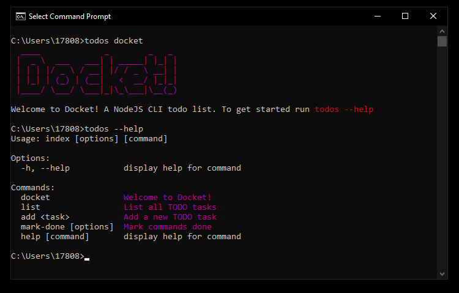

Hello there. This tool is a very simple to use to-do app built for the command line. It's very easy to customize this program if need be and the whole program consists of 5 JS files. I've created this as a learning project and I find it useful since I can stay in the terminal and keep track of small tasks when working with a large codebase. You can find it on Github @ (github.com/ccbagel/docket-cli.)

To install this program, run `npm i docket-cli`

1. To start, run `todos docket` OR you can skip the intro and use one of the commands below to start a task.

2. To create a new item in your todo list, run `todos add "task" `.

3. To see your current tasks, run `todos list`.

4. To mark a task complete, run `todos -t` OR `todos --task <tasks...>`. 
NOTE: if you run `todos -t` OR `todos --task` without specifying the task(s) which have their index number (ie 0, 1, 2 etc) in the list, you'll mark all your tasks done. 

If you need help, run `todos --help` to see the commands you can run.
Happy hacking 😎